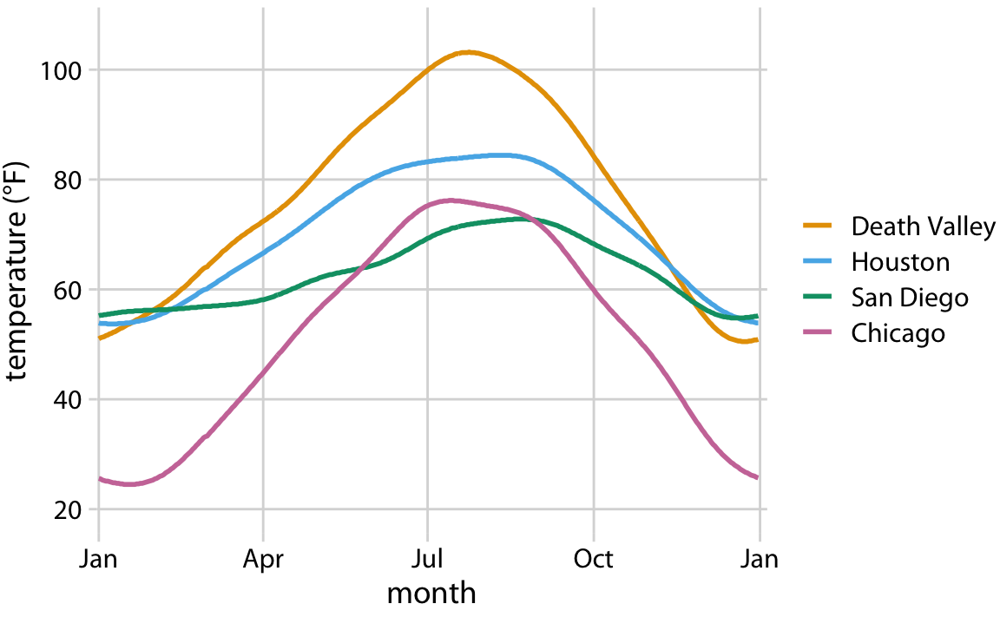

<style>
.remark-slide-content > h1 {
  font-size:42px;
  margin-top: -100px;
}
</style>
```{css, echo=F, include=F}

code.r.hljs.remark-code{
#  background-color: #cccccc;
    font-size: 13px;
    font-family:Monaco;
}
code.r.hljs.remark-inline-code { 
    font-size: 13px;
    font-family:Monaco;
}

.remark-slide-content > h2:first-of-type {
  margin-top: 0px;
}

@media print {
  .has-continuation {
    display: block !important;
  }
}


pre {
  white-space: pre-wrap;
  
}

ul:first-child, ol:first-child {
    margin: 0;
}

.pull-left2{
  float: left;
  width: 85%;
}

.pull-right2{
  float: right;
  width: 30%;
}
```


```{r setup, include=FALSE, echo=FALSE}
options(htmltools.dir.version = FALSE)
knitr::opts_chunk$set(fig.width=6, fig.height=4)
library(xaringan)
library(tidyverse) 
library(cowplot)
library(patchwork)
theme_set(theme_cowplot())
```

---
class: middle, center


```{r out.width = '600px', echo=F}
knitr::include_graphics("static/img/ggplot-grammar-of-graphics-stack-1.png")
```

---

# Recall the msleep dataset

```{r}
head(msleep)
```

--

```{r}
msleep %>% 
  drop_na() %>%
  filter(vore %in% c("herbi", "omni", "carni")) -> msleep_subvore
```

---

# Identifying components of a plot

```{r, echo=F}
msleep_subvore %>%
  ggplot(aes(x = vore, y = awake)) + geom_boxplot()
```

#### **Aesthetics**: How is the data *mapped onto* visual elemnts of the plot?
+ X-axis?
+ Y-axis?
+ Colors? Shapes? Sizes?

#### **Geometries**: What *shapes* aka *geometric objects* are displayed in the plot?


---

# Identifying components of a plot

```{r, echo=F}
msleep_subvore %>%
  ggplot(aes(x = vore, y = awake, fill = vore)) + geom_boxplot() +theme(legend.position = "none")
```


---

# Identifying components of a plot

.pull-left[
```{r, echo=F}
msleep_subvore %>%
  ggplot(aes(x = vore, y = awake, fill = vore)) + geom_boxplot() + theme(legend.position = "none")
```
]

.pull-right[
```{r, echo=F}
msleep_subvore %>%
  ggplot(aes(x = vore, y = awake)) + geom_boxplot(fill = "cadetblue")
```
]

---

# Identifying components of a plot

.pull-left[
```{r, echo=F}
msleep_subvore %>%
  ggplot(aes(x = vore, y = awake, fill = vore)) + geom_boxplot() + theme(legend.position = "none")
```
]

.pull-right[
```{r, echo=F}
msleep_subvore %>%
  ggplot(aes(x = awake, fill = vore)) + geom_density(alpha = 0.6) + theme(legend.position = "top")
```
]

---

# Identifying components of a plot

.pull-left[
```{r, echo=F, fig.height = 8}
msleep_subvore %>%
  ggplot(aes(x = vore, y = awake, fill = vore)) + geom_boxplot() + theme(legend.position = "none") -> a
msleep_subvore %>%
  ggplot(aes(x = vore, y = awake, fill = vore)) + geom_violin() + theme(legend.position = "none") -> b

a/b

```
]

.pull-right[
```{r, echo=F}
msleep_subvore %>%
  ggplot(aes(x = awake, fill = vore)) + geom_density(alpha = 0.6) + theme(legend.position = "top") 
```
]

---

# Identifying components of a plot

.pull-left[
```{r, echo=F, fig.height = 8}
msleep_subvore %>%
  ggplot(aes(x = vore, y = awake, fill = vore)) + geom_boxplot() + theme(legend.position = "none") -> a
msleep_subvore %>%
  ggplot(aes(x = vore, y = awake, fill = vore)) + geom_violin() + theme(legend.position = "none") -> b

a/b

```
]

.pull-right[
```{r, echo=F, fig.height = 8, message=F}
msleep_subvore %>%
  ggplot(aes(x = awake, fill = vore)) + geom_density(alpha = 0.6) + theme(legend.position = "top") -> a
msleep_subvore %>%
  ggplot(aes(x = awake, fill = vore)) + geom_histogram(color="grey30", bins = 5) + facet_grid(~vore) + theme(legend.position = "none")-> b

a/b
```
]

---

# Identifying components of a plot

.pull-left[
```{r, echo=F}
msleep_subvore %>%
  ggplot(aes(x = vore, y = awake, fill = vore)) + geom_boxplot() + theme(legend.position = "none")
```
]

--

.pull-right[
```{r, echo=F}
msleep_subvore %>%
  ggplot(aes(x = vore, y = awake, fill = vore)) + geom_boxplot() + theme(legend.position = "none") + scale_fill_brewer(palette = "Set2")
```
]

---

# Identifying components of a plot

.pull-left[
```{r, echo=F}
msleep_subvore %>%
  ggplot(aes(x = vore, y = awake, fill = vore)) + geom_boxplot() + theme(legend.position = "none")
```
]

.pull-right[
```{r, echo=F}
msleep_subvore %>%
  ggplot(aes(x = vore, y = awake, fill = vore)) + geom_boxplot(color = "yellow", size=3) + theme(legend.position = "none")
```
]

---

# Identifying components of a plot

.pull-left[
```{r, echo=F}
msleep_subvore %>%
  filter(bodywt <= 5) %>%
  ggplot(aes(x = bodywt, y = brainwt)) + geom_point()
```
]

--

.pull-right[
```{r, echo=F}
msleep_subvore %>%
  filter(bodywt <= 5) %>%
  ggplot(aes(x = bodywt, y = brainwt)) + geom_point(size = 4) + 
  xlab("Body weight (kg)") + ylab("Brain weight (kg)") + ggtitle("Mammal brain vs. body weight")
```
]

---


# Identifying components of a plot

.pull-left[
```{r, echo=F}
msleep_subvore %>%
  filter(bodywt <= 5) %>%
  ggplot(aes(x = bodywt, y = brainwt, color = vore)) + geom_point(size = 4) + 
  xlab("Body weight (kg)") + ylab("Brain weight (kg)") + ggtitle("Mammal brain vs. body weight")+ theme(legend.position="right")
```
]

--


.pull-right[
```{r, echo=F}
msleep_subvore %>%
  filter(bodywt <= 5) %>%
  ggplot(aes(x = bodywt, y = brainwt, color = awake)) + geom_point(size = 4) + 
  xlab("Body weight (kg)") + ylab("Brain weight (kg)") + ggtitle("Mammal brain vs. body weight") + theme(legend.position="right") 
```
]

---


# Identifying components of a plot

.pull-left[
```{r, echo=F}
msleep_subvore %>%
  filter(bodywt <= 5) %>%
  ggplot(aes(x = bodywt, y = brainwt)) + geom_point(shape = 17, size=3) + 
  xlab("Body weight (kg)") + ylab("Brain weight (kg)") + ggtitle("Mammal brain vs. body weight")+ theme(legend.position="right")
```
]

--

.pull-right[
```{r, echo=F}
msleep_subvore %>%
  filter(bodywt <= 5) %>%
  ggplot(aes(x = bodywt, y = brainwt, shape = vore)) + geom_point(size = 4) + 
  xlab("Body weight (kg)") + ylab("Brain weight (kg)") + ggtitle("Mammal brain vs. body weight") + theme(legend.position="right") 
```
]


---

# Identifying components of a plot

.pull-left[
```{r, echo=F}
msleep_subvore %>%
  filter(bodywt <= 5) %>%
  ggplot(aes(x = bodywt, y = brainwt)) + geom_point(shape = 17, size=3) + 
  xlab("Body weight (kg)") + ylab("Brain weight (kg)") + ggtitle("Mammal brain vs. body weight")+ theme(legend.position="right")

msleep_subvore %>%
  filter(bodywt <= 5) %>%
  ggplot(aes(x = bodywt, y = brainwt, shape = vore)) + geom_point(color = "hotpink", size = 4) + 
  xlab("Body weight (kg)") + ylab("Brain weight (kg)") + ggtitle("Mammal brain vs. body weight") + theme(legend.position="right") 
```
]


.pull-right[
```{r, echo=F}
msleep_subvore %>%
  filter(bodywt <= 5) %>%
  ggplot(aes(x = bodywt, y = brainwt, shape = vore)) + geom_point(size = 4) + 
  xlab("Body weight (kg)") + ylab("Brain weight (kg)") + ggtitle("Mammal brain vs. body weight") + theme(legend.position="right") 
```
]

---


# Identifying components of a plot

.pull-left[
```{r, echo=F}
msleep_subvore %>%
  filter(bodywt <= 5) %>%
  ggplot(aes(x = bodywt, y = brainwt)) + geom_point(shape = 17, size=3) + 
  xlab("Body weight (kg)") + ylab("Brain weight (kg)") + ggtitle("Mammal brain vs. body weight")+ theme(legend.position="right")

msleep_subvore %>%
  filter(bodywt <= 5) %>%
  ggplot(aes(x = bodywt, y = brainwt, shape = vore)) + geom_point(color = "hotpink", size = 4) + 
  xlab("Body weight (kg)") + ylab("Brain weight (kg)") + ggtitle("Mammal brain vs. body weight") + theme(legend.position="right") 
```
]


.pull-right[
```{r, echo=F}
msleep_subvore %>%
  filter(bodywt <= 5) %>%
  ggplot(aes(x = bodywt, y = brainwt, shape = vore)) + geom_point(size = 4) + 
  xlab("Body weight (kg)") + ylab("Brain weight (kg)") + ggtitle("Mammal brain vs. body weight") + theme(legend.position="right") 
msleep_subvore %>%
  filter(bodywt <= 5) %>%
  ggplot(aes(x = bodywt, y = brainwt, size = awake)) + geom_point(color = "hotpink") + 
  xlab("Body weight (kg)") + ylab("Brain weight (kg)") + ggtitle("Mammal brain vs. body weight") + theme(legend.position="right")
```
]

---


# Do the axes look at all "strange" to you?


.pull-left[
```{r, echo=F}
msleep_subvore %>%
  filter(bodywt <= 5) %>%
  ggplot(aes(x = bodywt, y = brainwt)) + geom_point(size = 4) + 
  xlab("Body weight (kg)") + ylab("Brain weight (kg)") + ggtitle("Mammal brain vs. body weight")
```
]

--

.pull-right[
```{r, echo=F}
msleep_subvore %>%
  ggplot(aes(x = bodywt, y = brainwt)) + geom_point(size = 4) + 
  xlab("Body weight (kg)") + ylab("Brain weight (kg)") + ggtitle("Mammal brain vs. body weight")
```
]

---
class: center

# Use log scales for data with extreme ranges

```{r, echo=F}
msleep_subvore %>%
  ggplot(aes(x = bodywt, y = brainwt)) + geom_point(size = 4) + 
  xlab("Body weight (kg)") + ylab("Brain weight (kg)") + ggtitle("Mammal brain vs. body weight") + scale_x_log10() + scale_y_log10()
```

---

# Let's practice

<br><br>

+ What variable is on the X-axis? What *type* of data is it?

+ What variable is on the Y-axis? What *type* of data is it?

+ Are there colors or fills? Are they "just colors" or are they *aesthetics*?

+ What are the geometries in the plot?

+ What *question about the data* does the plot address? (there can be many right answers here!)


All figures in the following slides are from [Fundamentals of Data Visualization](https://serialmentor.com/dataviz/).


---
class: center


# Average daily temperatures

```{r out.width = '600px', echo=F}

```

Daily temperature normals for four selected locations in the U.S. Temperature is mapped to the y axis, day of the year to the x axis, and location to line color. Data source: NOAA.

---
class: center


# Box office income

```{r out.width = '600px', echo=F}
knitr::include_graphics("static/img/plots_for_learning_plots/boxoffice-horizontal-1.png")
```

Highest grossing movies for the weekend of December 22-24, 2017, displayed as a horizontal bar plot. Data source: Box Office Mojo (http://www.boxofficemojo.com/).

---
class: center


# Median household income

```{r out.width = '600px', echo=F}
knitr::include_graphics("static/img/plots_for_learning_plots/income-by-age-race-dodged-1.png")
```

2016 median U.S. annual household income versus age group and race. For each age group there are four bars, corresponding to the median income of Asian, white, Hispanic, and black people, respectively. Data source: United States Census Bureau.


---
class:center

# Butterfat from different cows


```{r out.width = '600px', echo=F}
knitr::include_graphics("static/img/plots_for_learning_plots/butterfat-densitites-1.png")
```


Density estimates of the butterfat percentage in the milk of four cattle breeds. Data Source: Canadian Record of Performance for Purebred Dairy Cattle.

---
class: center

# Bluejays

```{r out.width = '600px', echo=F}
knitr::include_graphics("static/img/plots_for_learning_plots/blue-jays-scatter-sex-1.png")
```

Head length versus body mass for 123 blue jays. The birds’ sex is indicated by color. At the same body mass, male birds tend to have longer heads (and specifically, longer bills) than female birds. Data source: Keith Tarvin, Oberlin College.

---

# Airplane delays


.pull-left[
```{r out.width = '500px', echo=F}

```
]

.pull-right[
Mean arrival delay versus distance from New York City. Data source: U.S. Dept. of Transportation, Bureau of Transportation Statistics. 

This figure is labeled as “bad” because it is overly complex. Most readers will find it confusing and will not intuitively grasp what it is the figure is showing.
]


--

**"Looking cool" is NOT the same as effectively communicating.**

Analogy: "I don't know what the exam answer is, so I'll just write down literally every buzzword I remember the professor saying." *Don't do this. It does NOT make you look smarter. Same goes for kitchen-sink figures.*